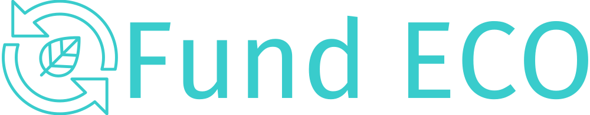

# Fund ECO



____________________
Yield your capital and support sustainable development by investing in local Energy Communities!

The project aims to create a platform that enables individuals to invest in sustainable energy projects globally and create energy communities in their local areas. The platform is designed to facilitate crowdlending, which allows multiple investors to pool their money together to fund a project. 

By lending capital, individuals earn a return on their investment, as the platform will offer competitive interest rates to investors. It also helps in reducing the carbon footprint and support the growth of the green economy.


## Problem

We see several problems in the world related to sustainable energy growth:

1. As individuals, most energy community members face several limitations to build solar projects. These include lack of capital, space and property.

2. Communities want an easier way to raise funds to establish and further sustainable energy like solar.

3. Investors want an easy way to fund sustainable energy projects locally and globally

## Target Users

Energy Community members who want to raise funds for sustainable energy projects
Investors who want to invest in sustainable energy and earn yield

## Solution

1. Fund ECO allows users to build community and a treasury to invest in sustainable energy projects 

2. Fund ECO allows users to create a campaign to raise funds

3. Fund ECO gives you the chance to invest in real sustainable energy projects and earn a return on your investment. 

By lending capital, individuals earn a return on their investment, as the platform will offer competitive returns to investors via two ways, 

i) sale of excess energy to the grid, 

ii) sale of energy within the energy communities. 

These activities combined help in reducing the carbon footprint and support the growth of access to renewable energy sources.
___________________
## Tech stack

1.	Next.js, React, Redux, dappKit and rocketKit for building the dApp fronted 
2.	IPFS to store images of energy community membership NFTs
3.	EVM-compatible smart contracts written in Solidity provides business logic and trust for the platform
4.	Sign-up/in with email "code" mechanism for easy onboarding, especially for non-Web3 users


## Smart contracts funcionalities

The smart contracts used in Fund ECO provide the following:

- Create new Campaigns: Creates can use the platform to create new funding campaigns for their sustainable projects
- Pledge/Unpledge tokens: Investors can pledge or unpledged tokens to the campaigns they want to support
- Claim funds: Creators can claim the funds they have raised to invest in their sustainable projects
- Claim pledged tokens with an APY:  Users can claim the pledged tokens they have contributed to a campaign with an Annual Percentage Yield(APY) provided by the campaign

### User Flow


## Challenges we ran into

Developing the FundECO platform required a comprehensive understanding of various Web3 technologies, including those related to the Pyth Network, dappKit, rocketKit, and Mantle. As a team, we worked diligently to familiarize ourselves with these technologies, which proved to be an exciting effort and a significant learning curve.  

## Accomplishments that we're proud of

Our team is proud of the significant achievements we made in building Fund ECO. We built an MVP using cutting-edge Web3 technologies to support sustainable projects and energy communities through decentralized and transparent crowdlending mechanisms.

## What we learned

Despite the initial challenges we faced in familiarizing ourselves with the latest Web3 technologies, we are proud to have developed Fund ECO using newer web3 technolgies.  We learned that by asking for the right help, reading the documentation, and connecting with the sponsor teams, we were able to diligently build our way to a successful deployment. This experience will enable us to enhance our platform and build even more innovative and impactful solutions in the future.

Our team worked tirelessly to deploy the smart contracts and integrate the front-end and back-end systems of FundECO within a tight timeframe. Through this process, we gained a deeper understanding of how to build robust and decentralized applications on the blockchain, and the immense utility that they can provide to users. Building FundECO has demonstrated to us the potential of blockchain technology as a powerful tool for enabling secure, transparent, and trustless transactions.

## What's next for Fund ECO
With the right funding the project could continue to build and do the following:
1.	Conducting a market test and getting feedback from energy communities and sustainable energy investors. We plan to start with the energy communities in Europe and on-board attendees, but having a global reach it can reach millions.
2.	Validate all assumptions and test in the field: Coordinate with different sustainable energy providers and research universities and their community and see how the solution would work and gather feedback to see what needs to be better. 
3.	Bring on more team members.

____________________
## Setup

### Pre-requisites

- [Git](https://git-scm.com/book/en/v2/Getting-Started-Installing-Git)
- [Docker Installation](https://docs.docker.com/engine/install/)
- [Docker Compose Installation](https://docs.docker.com/compose/install/)

### Local Setup

1. Build the images

```
$ docker-compose build
```

2. Run the containers

```
$ docker-compose up
```

3. Run specific container

```
$ docker-compose up frontend
```


-----

Made with 💚 at ETH Porto by Fund ECO
